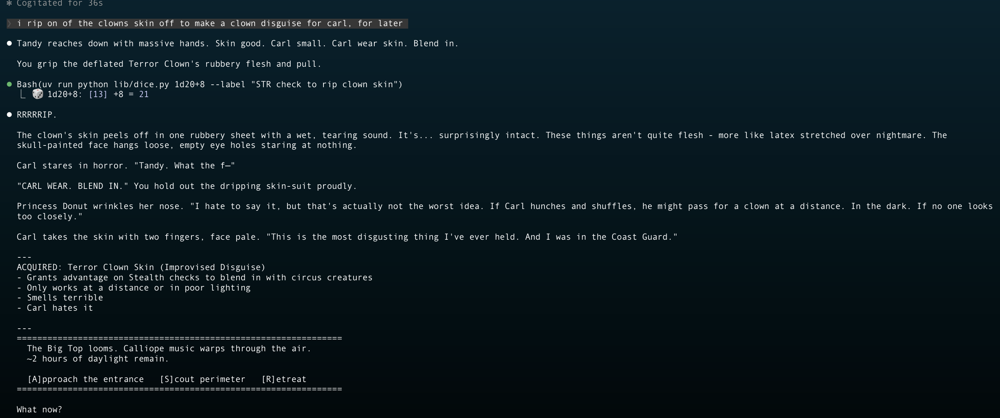
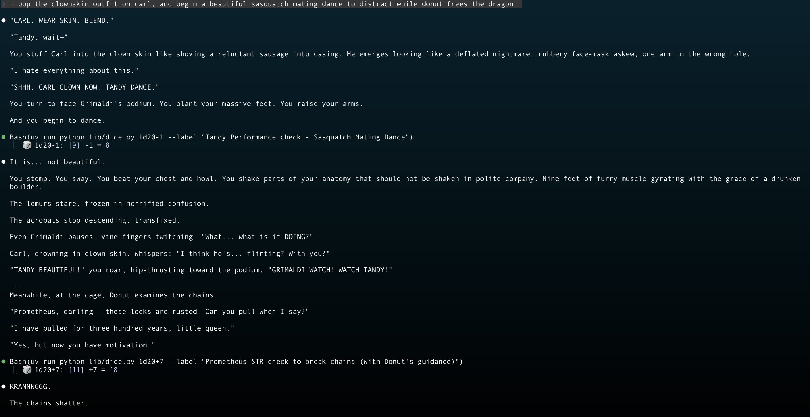
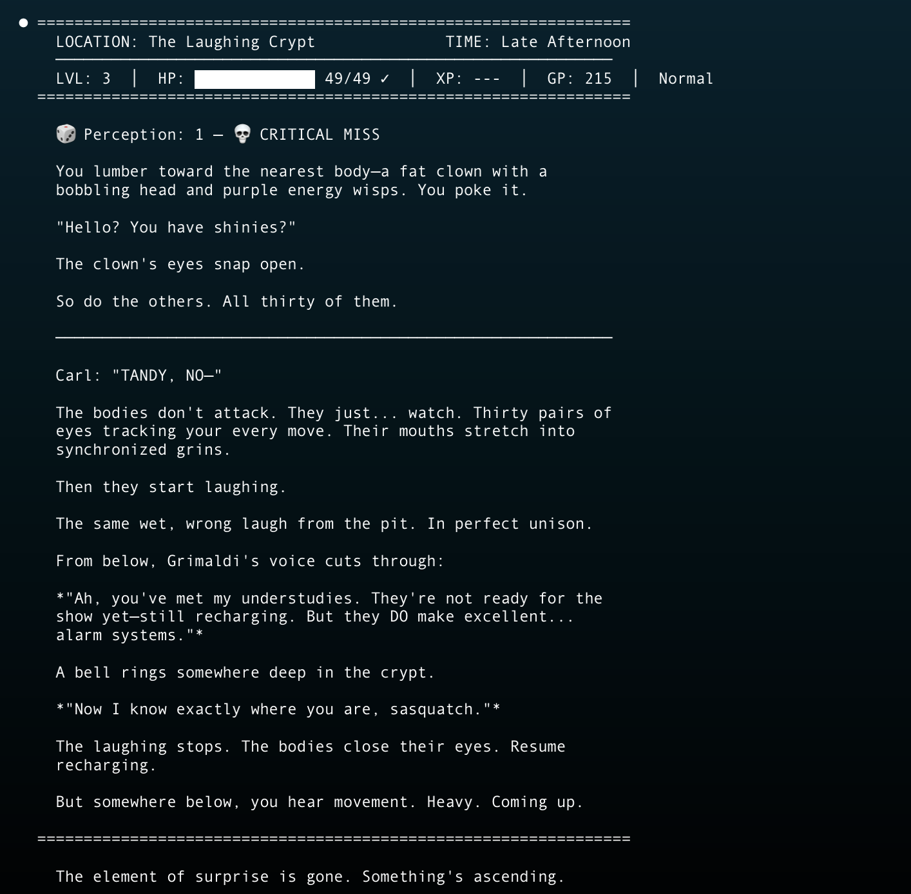

# DM Claude

**Drop any book into it. Play inside the story.**

Got a favorite fantasy novel? A classic adventure module? A weird obscure sci-fi book from the 70s? Drop the PDF in, and DM Claude extracts every character, location, item, and plot thread, then drops you into that world as whoever you want to be.

Be a character from the book, someone original, or just yourself walking into the story. Every round, the AI queries the actual source material — NPCs talk like they do in the book, locations look like the author described them, and plot points unfold the way they should... until your choices change things.

The [Internet Archive](https://archive.org/) is a goldmine for this. Thousands of free books, adventure modules, and old pulp novels. Jump into *IT* and help the bad guys. Drop into *Lord of the Rings* and play from Gollum's perspective. It's your call.

D&D 5e rules aren't really the point — they're just there to give the story stakes and consequences. You don't need to know D&D at all, just say what you want to do.

---

## In Action — Dungeon Crawler Carl

A campaign imported from *Dungeon Crawler Carl*. Tandy the sasquatch rips the skin off a Terror Clown, forces Carl to wear it as a disguise, then performs a sasquatch mating dance to distract Grimaldi while Donut frees the dragon. Standard Tuesday.







---

## Getting Started

**Prerequisites:** [Claude Code](https://docs.anthropic.com/en/docs/claude-code) and Python 3.11+

```bash
git clone https://github.com/Sstobo/Claude-Code-Game-Master.git && cd Claude-Code-Game-Master && claude
```

1. Ask the agent to set up dependencies
2. Once it's done, drop a PDF in the `source-material/` folder
3. Run `/dm` and let the agent guide you

That's it. The AI handles installation, world extraction, character creation, and gameplay.

---

## What Happens Under the Hood

When you import a document, the system vectorizes it locally with ChromaDB and spawns extraction agents that pull the book apart into structured data. During gameplay, every scene gets grounded in real passages from your source material — the AI isn't making things up, it's drawing from the text.

Everything persists. NPCs remember what you said last session. Piss off a shopkeeper? That's tracked. The system schedules consequences that fire days later in-game time. Locations change as events unfold. Plot threads track your progress. Save and restore at any point.

Specialist agents spin up on the fly. A fight starts and the monster-manual agent grabs real stat blocks. Cast a spell and the spell-caster agent looks up actual mechanics. Shopping? The gear-master has 237+ equipment items and 362+ magic items. The player never sees any of this — they just see the story — but you can always pull up the hood and see what's going on.

It uses the [D&D 5e API](https://www.dnd5eapi.co/) for official rules, spellbooks, monsters, and equipment. This grounds everything in real mechanics and keeps Claude from just picking numbers.

---

## Advanced

Everything below is handled automatically by the `/dm` command, but you can call these directly if you want manual control.

### Dependencies

Installed automatically during setup via [uv](https://docs.astral.sh/uv/):

**Core:**
| Package | Purpose |
|---------|---------|
| `anthropic` | Claude API client |
| `pdfplumber` | PDF text extraction |
| `pypdf2` | PDF parsing |
| `python-docx` | Word document support |
| `python-dotenv` | Environment variable loading |
| `requests` | HTTP requests (D&D 5e API) |

**RAG (for document import):**
| Package | Purpose |
|---------|---------|
| `sentence-transformers` | Text embeddings for semantic search |
| `chromadb` | Vector database for RAG retrieval |

### Slash Commands

| Command | What it does |
|---------|--------------|
| `/dm` | Start or continue your story |
| `/dm save` | Save your progress |
| `/dm character` | View your character sheet |
| `/dm overview` | See the world state |
| `/new-game` | Create a world from scratch |
| `/create-character` | Build your character |
| `/import` | Import a PDF/document as a new campaign |
| `/enhance` | Enrich entities with source material via RAG |
| `/world-check` | Validate campaign consistency |
| `/reset` | Clear campaign state |
| `/setup` | Verify/fix installation |
| `/help` | Full command reference |

### Bash Tools

All tools follow the pattern: `bash tools/dm-<tool>.sh <command> [args]`

| Tool | Purpose |
|------|---------|
| `dm-campaign.sh` | Create, list, switch, and delete campaigns |
| `dm-session.sh` | Session lifecycle, party movement, save/restore |
| `dm-player.sh` | Player stats — HP, XP, gold, inventory, conditions |
| `dm-npc.sh` | NPC creation, updates, party member management |
| `dm-location.sh` | Location creation and connections |
| `dm-plot.sh` | Quest and storyline tracking |
| `dm-search.sh` | Search world state and/or source material |
| `dm-enhance.sh` | RAG-powered entity enrichment |
| `dm-extract.sh` | Document import and extraction pipeline |
| `dm-consequence.sh` | Future event scheduling and triggers |
| `dm-condition.sh` | Player condition tracking (poisoned, stunned, etc.) |
| `dm-note.sh` | Record world facts by category |
| `dm-time.sh` | Advance in-game time |
| `dm-overview.sh` | Quick world state summary |
| `dm-reset.sh` | Reset campaign data |

### Specialist Agents

These spawn automatically during gameplay when context demands it:

| Agent | Triggered by |
|-------|--------------|
| `monster-manual` | Combat encounters |
| `spell-caster` | Casting spells |
| `rules-master` | Mechanical edge cases |
| `gear-master` | Shopping, identifying gear |
| `loot-dropper` | Victory, treasure discovery |
| `npc-builder` | Meeting new NPCs |
| `world-builder` | Exploring new areas |
| `dungeon-architect` | Entering dungeons |
| `create-character` | New characters |

---

## License

This work is licensed under [CC BY-NC-SA 4.0](https://creativecommons.org/licenses/by-nc-sa/4.0/) — free to share and adapt for non-commercial use. See [LICENSE](LICENSE) for details.

---

Built by [Sean Stobo](https://www.linkedin.com/in/sean-stobo/). Your story awaits. Run `/dm` to begin.
